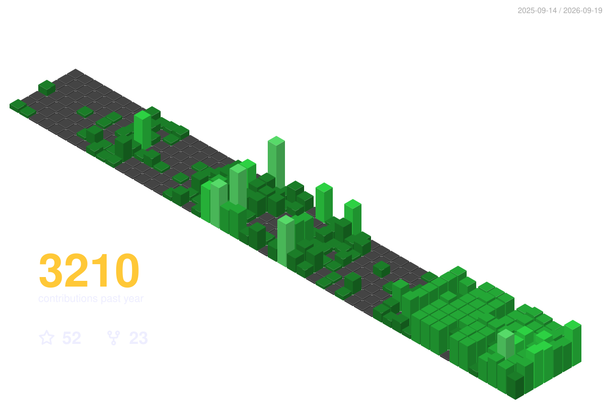

# rohan muppa

ECE @ Purdue

<picture>
  <source media="(prefers-color-scheme: dark)" srcset="https://raw.githubusercontent.com/RohanMuppa/RohanMuppa/output/snake-dark.svg">
  <source media="(prefers-color-scheme: light)" srcset="https://raw.githubusercontent.com/RohanMuppa/RohanMuppa/output/snake.svg">
  
</picture>

  </img>

## projects

- ⚡ **hstack** - hackathon skills pack for Claude Code: centralizes research, ideation, planning, and presentation so you just build
- 📚 **brightspace-mcp-server** - MCP server for Brightspace LMS
- 📌 **Piazza-MCP** - read-only MCP server for browsing Piazza course forums: feed, search, threads, attachments, and a cross-class daily digest
- 🌍 **Purdue Campus Geoguessr** - campus geoguessr game
- 🌱 **GreenGarden** - garden management app
- 📖 **PageFund** - stock market for books
- 💰 **Finance** - full-stack investment simulation (CS50)
- 🔧 **ProtoCAD** - AI circuit design platform
- 🗺️ **BoilerMaps** - campus navigation with an AI layer
- 🏛️ **West Lafayette Wire** - civic data engine

## Hackathon Projects
- 🎯 **Arete** (Nexhacks 2026) - agentic AI interview tool
- 🌎 **Xperience** (UIUC 2026) - API that transforms 2D media into curated interactive 3D simulations
- 🏆 **Squid** (HackIndy 2026 Winner) - Trust layer for agentic transactions. Think PayPal for AI agents.
- 🏆 **Supply Shock** (C3 Game Jam Winner) - game exploring Latvia's short food supply chain resilience during COVID-19 (HONR 299 Course)
- 🏆 **SIQUR** (Catapult 2026 Winner) - Intelligent surveillance suite: optimal camera placement, 3D Gaussian splat world model, and AI video intelligence search

## contributing to
- 🤖 **Get-Shit-Done** - An open source agent skill for streamlining agentic workflows that I contribute to
- 🎤 **Handy** - Live Text to Speech transcriber. Never use your keyboard again.

## links

## tools & languages

